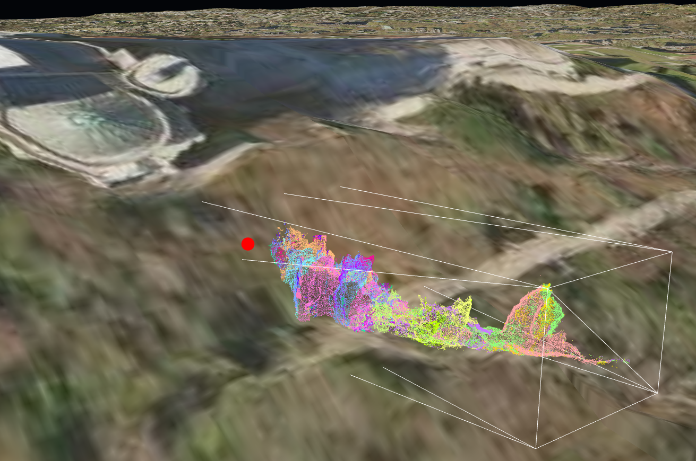

An [UD-Viz based](https://github.com/VCityTeam/UD-Viz) web-application that displays
underground cave/tunnel-systems.

A dockerized version is available at
[TunNetView-docker](https://github.com/VCityTeam/TunNetView-docker)

A deployed demo is available at
https://tunnetview.vcityliris.cma.alpha.grandlyon.com/ (the illustrated
[cave data is available here](https://dataset-dl.liris.cnrs.fr/elaphes-cave/))



## For the impatient

```bash
git clone https://github.com/VCityTeam/TunNetView.git   # This repository
cd TunNetView
```

```bash
npm run clean
npm install
npm run build
npm run start
```

```bash
open http://localhost:8000
```

## Runtime environment variables

The following environment variables are recognized

- `PORT` in order to configure the port listened by the http server,
- `SYNTHETIC_CAVE_URL` in order to designate the `URL` of the cave point cloud

Usage example

```bash
export PORT=8099
export SYNTHETIC_CAVE_URL=https://dataset-dl.liris.cnrs.fr/synthetic-cave-and-tunnel-systems/Cave/cave_sub_1_grid_size_x_1_grid_size_y_1_point_cloud-3dtiles/tileset-translated-to-lyon-cathedral.json
npm run start &
open http://localhost:$PORT
```

## Running with docker

Refer to the [TunNetView-docker](https://github.com/VCityTeam/TunNetView-docker) repository.

## Alternatives

Two websites dedicated to 3D rendering of Lyon Fishbones tunnel systems

- A [croud funded website](https://aretesdepoisson.org/)
- A [publicly funded website](https://aretesdepoisson.lyon.fr/), described in a [press article in Le Monde](https://www.lemonde.fr/m-le-mag/article/2024/09/27/a-lyon-d-antiques-aretes-de-poisson-a-visiter-en-mode-virtuel_6337001_4500055.html).
